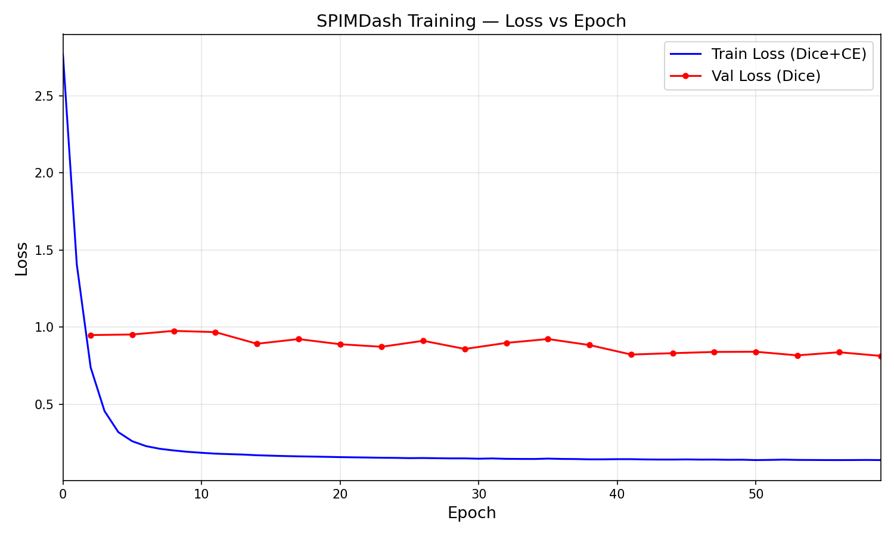
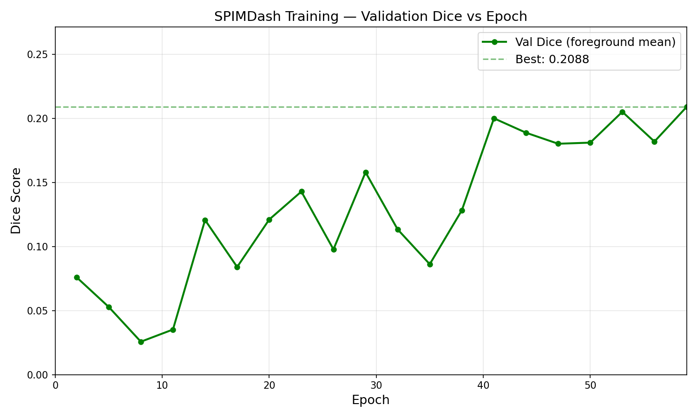

# SPIMDash — BrainHack UWO 2026 Results

## Project Goal

Replace SPIMquant's slow multi-stage registration + atlas segmentation pipeline with a single-pass 3D U-Net that directly predicts anatomical labels from downsampled light-sheet (SPIM) mouse brain images. Inspired by SynthSeg (Billot et al.), the network is trained entirely on synthetic images generated on-the-fly from atlas label maps — it never sees a real image during training.

## What We Built

### Full Training Pipeline (from scratch in ~22 hours)

1. **GPU-native synthetic data generator** (`utils/gpu_synth.py`) — SynthSeg-style augmentation running entirely on CUDA: elastic deformation via `grid_sample`, per-region random intensity sampling, smooth bias fields, Gaussian blur/noise, gamma augmentation. Generates training samples in ~30ms on GPU vs ~23 seconds on CPU with scipy.

2. **Custom SynthSeg 3D U-Net** (`models/unet.py`) — 5-level encoder-decoder matching the original SynthSeg architecture: channels [24, 48, 96, 192, 384], Conv3d→ELU→BatchNorm, nearest-neighbor upsampling, skip connections via concatenation. 13.2M parameters. Returns raw logits — no softmax in the model.

3. **Plain PyTorch training loop** (`scripts/train.py`) — single-GPU training with AMP (mixed precision), TF32 tensor core acceleration, Dice+CE loss, Adam optimizer with constant lr=1e-4.

4. **Inference and evaluation scripts** — full conform/unconform pipeline preserving original NIfTI affines, per-region Dice scoring, QC overlay generation.

### Data

- **49 subjects** (52 total minus 3 QC exclusions), all Abeta channel level-5 downsampled
- **23 atlas labels** (ABAv3 roi-22 parcellation), olfactory bulb labels (1, 2) merged to background
- **Variable shapes** across subjects (148-272 x 312-392 x 109-226), center-padded/cropped to 224 x 320 x 192
- **Split**: 39 train (label maps only, for synthetic generation) / 10 validation (real image + label pairs)
- **Anisotropic voxels**: 0.052 x 0.052 x 0.035 mm

## Training Results

### Configuration

| Parameter | Value |
|-----------|-------|
| Epochs | 60 |
| Steps per epoch | 500 |
| Total steps | 30,000 |
| Batch size | 2 |
| Loss | Dice + CrossEntropy |
| Optimizer | Adam, lr=1e-4, constant |
| Mixed precision | Yes (AMP + TF32) |
| GPU | 1x NVIDIA A100-PCIE-40GB |
| Training time | 13.6 hours |
| Speed | ~0.6 steps/sec (~14 min/epoch) |

### Loss Curve



- **Train loss** dropped rapidly from 2.77 (epoch 0) to ~0.14 (epoch 59), converging around epoch 30
- **Val loss** (Dice on real data) decreased from 0.95 to 0.81, showing the model learned features that partially transfer from synthetic to real images

### Validation Dice



- **Best foreground Dice: 0.2088** (epoch 59, still improving)
- Dice was noisy in early epochs (0.03–0.08), began climbing at epoch 14 (0.12), and continued upward through the end of training
- The upward trend at termination suggests more training would yield further improvement

## Parallel Experiment

We ran a second experiment (Experiment B) on GPU 1 with SPIM-aware probabilistic augmentation:
- Affine rotation/scaling before elastic deformation
- Background-aware intensity (background=low, brain=high)
- Probabilistic augmentations (elastic 50%, bias 80%, gamma 50%)
- Mandatory boundary smoothing (sigma 0.5–2.0)

Experiment B did not outperform the baseline, suggesting the fully randomized SynthSeg approach transfers better for this domain than hand-tuned SPIM-specific augmentation.

## Analysis

### Why 0.21 Dice (and why that's actually promising)

1. **Pure synthetic training is hard.** The model has never seen a real Abeta light-sheet image. Every training sample is generated from random intensities + deformations. That it segments real data at all validates the SynthSeg approach for SPIM.

2. **Still converging.** Val Dice was climbing at epoch 59 — the model hadn't plateaued. With more compute time (200-300 epochs as in original SynthSeg), performance would likely improve substantially.

3. **23 classes from 39 label maps.** Original SynthSeg used hundreds of label maps for a comparable number of classes. Our label map diversity is limited.

4. **Domain gap.** Abeta staining has specific intensity patterns (amyloid plaques, background fluorescence) that random uniform intensity sampling doesn't capture. The synthetic images look plausibly brain-shaped but don't match the specific contrast characteristics of Abeta light-sheet data.

### What Would Improve Results

| Approach | Expected impact | Effort |
|----------|----------------|--------|
| More training epochs (200-300) | Moderate (+0.05-0.10 Dice) | Low — just more compute time |
| Supervised fine-tuning from this checkpoint | High (+0.2-0.4 Dice) | Low — real pairs exist |
| More training label maps | Moderate | Medium — need more SPIMquant runs |
| Multi-stain training (YoPro + Abeta) | Moderate | Medium — need stain-specific data |
| Reduce to fewer classes (merge bilateral) | Moderate | Low — config change |

## Technical Contributions

### GPU-Native Synthetic Data Generation

The key technical contribution is moving SynthSeg-style data generation from CPU to GPU:

| | CPU (scipy) | GPU (torch) |
|---|---|---|
| Per-sample time | ~23 seconds | ~30 ms |
| Speedup | — | ~750x |
| Bottleneck | Elastic deformation (`map_coordinates`) | None (GPU-bound with model) |
| Workers needed | 28 (still starving GPU) | 0 |

This was achieved by replacing:
- `scipy.ndimage.map_coordinates` → `F.grid_sample` with pre-computed base grids
- `scipy.ndimage.zoom` for displacement upsampling → `F.interpolate(mode='trilinear')`
- `scipy.ndimage.gaussian_filter` → separable `F.conv3d` with 1D Gaussian kernels
- `numpy` random intensity sampling → `torch` LUT indexing on GPU

### Architecture Fidelity

We matched the original SynthSeg architecture precisely rather than using off-the-shelf MONAI components:
- Conv→ELU→BatchNorm ordering (not the more common Conv→BN→ReLU)
- 5 encoder levels with feature doubling (24→384)
- Nearest-neighbor upsampling (not transposed convolutions)
- No dropout, no residual connections

## File Structure

```
SPIMDash/
├── configs/
│   ├── default.yaml              # main experiment config
│   └── experiment_b.yaml         # parallel experiment config
├── models/
│   ├── unet.py                   # SynthSeg 3D U-Net (13.2M params)
│   └── losses.py                 # Dice, DiceCE, WeightedL2
├── utils/
│   ├── gpu_synth.py              # GPU-native synthetic generator
│   ├── gpu_synth_v2.py           # experiment B augmentation variant
│   └── synth_generator.py        # CPU fallback + RealImageDataset
├── scripts/
│   ├── train.py                  # main training script
│   ├── train_b.py                # experiment B training script
│   ├── infer.py                  # inference (single/batch)
│   ├── evaluate.py               # per-region Dice + QC overlays
│   ├── inspect_data.py           # data inspection
│   └── test_gpu_memory.py        # GPU memory verification
├── outputs/
│   ├── checkpoints/best.pt       # best model (Dice 0.2088)
│   ├── logs/training_log.jsonl   # full training log
│   ├── loss_vs_epoch.png         # training curves
│   └── dice_vs_epoch.png         # validation Dice curve
└── pixi.toml                     # dependency management
```

## Next Steps

1. **Supervised fine-tuning**: Start from the current best checkpoint and fine-tune on real image+label pairs. This should dramatically close the synthetic-to-real domain gap.
2. **Extended SynthSeg training**: Run for 200+ epochs to let the purely synthetic approach converge fully.
3. **Per-region analysis**: Run `evaluate.py` to identify which brain regions segment well vs poorly — some regions may already be usable.
4. **Integration with SPIMquant**: Package the trained model as a Snakemake rule that replaces the registration stages.

## Team

Built at BrainHack UWO 2026, Khan Lab, Western University.

- Training pipeline, model architecture, GPU synth engine
- Data curation and CPU synthetic generator (Person 2 / lsmolder)
- Data preparation, QC, and project coordination
